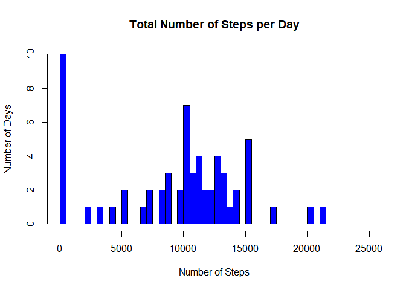
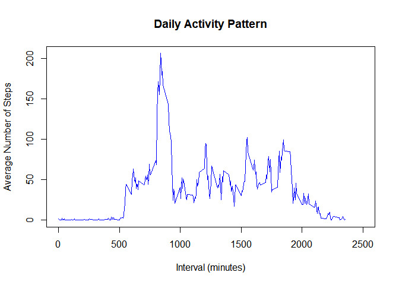
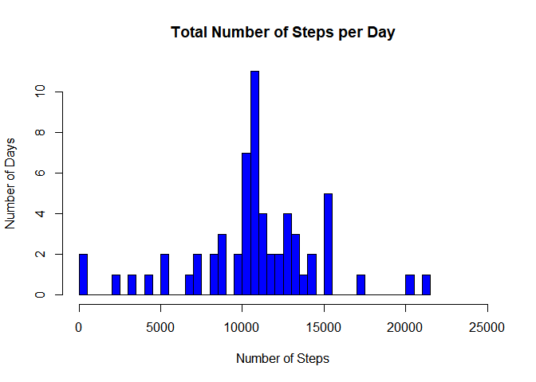
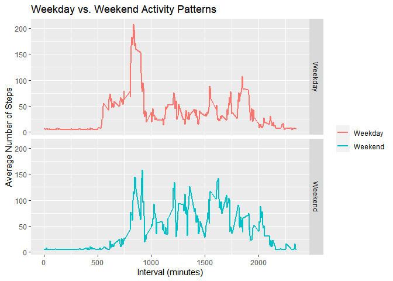

**Exploring various aspects of the daily monitoring of mobility data**
======================================================================


## 1. Loading and preprocessing the data

  The activity data is stored in an archived csv file *activity.zip* in the working directory
  We unzip it and create a data frame **Activity** from it, formatting the **date** column as a proper date in the **YYYY-MM-DD** format:  


```r
unzip("activity.zip","activity.csv")
Activity <- read.csv("activity.csv", header = TRUE,  na.strings = "NA", colClasses = c("numeric","character","numeric"))
Activity$date <- as.Date(Activity$date, "%Y-%m-%d")
```


## 2. What is mean total number of steps taken per day?

  To compute that, we sum up the number of steps (ignoring NA values) factored by day and present it as a histogram plot.
  

```r
#Calculating the total number of steps taken per day and plotting it as a histogram:
Total <- with(Activity, tapply(steps, date, sum, na.rm = TRUE))
hist(Total,  col = "blue", freq = TRUE, nclass = 40, xlim = c(1,25000), xlab = "",ylab = "",main = "")
title(xlab = "Number of Steps", ylab = "Number of Days",main = "Total Number of Steps per Day")
```

<!-- -->

  Total values for the *Average* and *Median* number of steps are presented as well:
    

```r
#Calculating and printing mean and median values of steps per day
MeanNumberOfSteps <- mean(Total)
MedianNumberOfSteps <- median(Total)
print(MeanNumberOfSteps)
```

```
## [1] 9354.23
```

```r
print(MedianNumberOfSteps)
```

```
## [1] 10395
```


## 3. What is the average daily activity pattern?

  Here we compute the mean number of steps for each 5-min interval and plot it as a time-series plot:


```r
#Average daily activity pattern and plotting it as a time series line:
AverageInterval <- aggregate(.~ interval, Activity[-2], mean)
plot(AverageInterval, type = "l", col = "blue", xlab = "", xlim = c(1,2500), ylab = "",main = "")
title(xlab = "Interval (minutes)", ylab = "Average Number of Steps", main = "Daily Activity Pattern")
```

<!-- -->

  One can see immediately that the plot contains a well-defined absolute activity peak, which is determined by the following straightforward calculation:
  

```r
#5-min interval containing maximum number of steps:
MaxSteps <- max(AverageInterval$steps)
MaxInterval <- AverageInterval$interval[AverageInterval$steps == MaxSteps]
print(MaxInterval)
```

```
## [1] 835
```

  This is the interval *(+5 min)* where this absolute maximum occurs.    

## 4. Imputing missing values

  The original data frame contains a number of *NA* values, the total number of which is computed here:
  
  In what follows, these values are replaced with the total average number of steps per a 5-min interval:
  

```r
#Computing the number of NA entries for steps:
NASteps <- is.na(Activity)
TotalNAEntries <- sum(NASteps)
print(TotalNAEntries)
```

```
## [1] 2304
```
  Now we will compute total average steps to impute *NA*s with:
  

```r
#Imputing the NA values in the data set: replacing them with the total mean number of steps per an interval.
AverageDaily <- aggregate(.~ date, Activity[-3], mean)
TotalAverageSteps = as.integer(mean(AverageDaily$steps))
print(TotalAverageSteps)
```

```
## [1] 37
```
  
  
  As a next step, we create another data set **AverageImputedPrep** with these values:
  

```r
AverageImputedPrep <- Activity
AverageImputedPrep$steps[is.na(AverageImputedPrep$steps)] <- TotalAverageSteps

print(head(AverageImputedPrep))
```

```
##   steps       date interval
## 1    37 2012-10-01        0
## 2    37 2012-10-01        5
## 3    37 2012-10-01       10
## 4    37 2012-10-01       15
## 5    37 2012-10-01       20
## 6    37 2012-10-01       25
```
  
  This new data frame returns slightly different step distribution per a 5-min interval:
  

```r
#Plotting number of steps per day as a histogram:
TotalImp <- with(AverageImputedPrep, tapply(steps, date, sum, na.rm = TRUE))
hist(TotalImp,  col = "blue", freq = TRUE, nclass = 40, xlim = c(1,25000), xlab = "",ylab = "",main = "")
title(xlab = "Number of Steps", ylab = "Number of Days",main = "Total Number of Steps per Day")
```

<!-- -->

  To confirm that, here are total values for the *Average* and *Median* number of steps with the new data frame:
  

```r
#Calculating and printing mean and median values of steps per day
MeanNumberOfStepsImp <- mean(TotalImp)
MedianNumberOfStepsImp <- median(TotalImp)
print(MeanNumberOfStepsImp)
```

```
## [1] 10751.74
```

```r
print(MedianNumberOfStepsImp)
```

```
## [1] 10656
```
  
  As one sees, the results are higher due to the imputed values.
  
## 5. Are there differences in activity patterns between weekdays and weekends?

  To do this, we add 2 vectors to our data frame with imputed values: the *name* of the weekday specified by the **date** value and a special factor discerning between *weekdays* and *weekends* (we will need to upload the library **dplyr** for that)


```r
library(dplyr)
```

```
## 
## Attaching package: 'dplyr'
```

```
## The following objects are masked from 'package:stats':
## 
##     filter, lag
```

```
## The following objects are masked from 'package:base':
## 
##     intersect, setdiff, setequal, union
```

```r
IsWeekend <- function(v){
  ifelse((weekdays(v) == "Saturday" | weekdays(v) == "Sunday" ), "Weekend", "Weekday")
  }
  
AverageImputedExt <- mutate(AverageImputedPrep, Weekdayname = weekdays(AverageImputedPrep$date), DayType = IsWeekend(AverageImputedPrep$date))
```

  Here are the first lines of the new data frame:
  

```r
#head of the new data frame:
print(head(AverageImputedExt))
```

```
##   steps       date interval Weekdayname DayType
## 1    37 2012-10-01        0      Monday Weekday
## 2    37 2012-10-01        5      Monday Weekday
## 3    37 2012-10-01       10      Monday Weekday
## 4    37 2012-10-01       15      Monday Weekday
## 5    37 2012-10-01       20      Monday Weekday
## 6    37 2012-10-01       25      Monday Weekday
```
  
  Finally, we build a 2-element plot showing the difference in activity distribution between weekdays and weekends:
  We will use **ggplot2** for that:
  

```r
#Plotting the results for weekdays and weekends:

library(ggplot2)
AverageIntervalImputedExt <- group_by(AverageImputedExt, interval, DayType)
AverageIntervalImputedSum <- summarise(AverageIntervalImputedExt, meanSteps = mean(steps))
ggplot(AverageIntervalImputedSum, aes(x=AverageIntervalImputedSum$interval, y=AverageIntervalImputedSum$meanSteps, color = AverageIntervalImputedSum$DayType)) + 
  facet_grid( AverageIntervalImputedSum$DayType ~.) +       
  geom_line(lwd = 1, linetype = "solid") +
  ggtitle("Weekday vs. Weekend Activity Patterns") + xlab("Interval (minutes)") + ylab("Average Number of Steps") +
  theme(legend.title=element_blank())
```

<!-- -->
  
  Here we see that the activity is more homogeniously distributed over weekends in comparison to weekdays.
  
  
